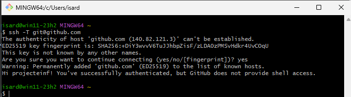

# Windows

## Generar parella clau pública/privada 

```bash
ssh-keygen -t rsa -b 4096 -C "el_teu_email@example.com"
``` 
Exemple amb usuari projecteinf (projecteinf@boscdelacoma.cat)


## Iniciar agent ssh

```bash
eval "$(ssh-agent -s)"
```


## Afegir clau privada a l'agent

```bash
ssh-add ~/.ssh/id_rsa
```


# Configuració GitHub - Tots els sistemes

Accedim a l'opció "SSH and GPG keys" del menú "Settings" associat a l'usuari.


Botó "New SSH key" i copiem la clau pública.


# Verificació

```bash
ssh -T git@github.com
```


